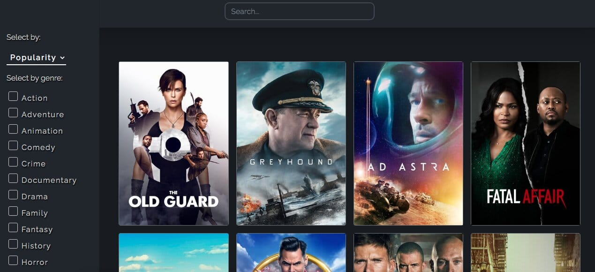

# VueJs Film Project
It's a VueJs based project that allows a user to search films by title, genre, popularity etc. It provides detailed film information, trailer, rating, reviews and similar films suggestions. I used external API [TheMovieDB](themoviedb.org). 
<br >
  By making the project, I wanted to get familiar with VueJs. On top of that, I got better with bootstrap and css. As an inspiration for the layout, style and some functionalities(popover, recreating trailer on pop up with modal) I used [Movieo](Movieo.me) . 
## Project setup

```
npm install
```

* Get API key from 
[TheMovieDB](https://developers.themoviedb.org/3/getting-started/introduction)

* Create **.env** file in the root of the project

* Copy parameters from **env.dist** to **.env**

* Paste API keys to parameter in **.env**
```
npm run serve
```

## Screenshots

DESKTOP Home page


DESKTOP Film page


MOBILE home and film pages

          


